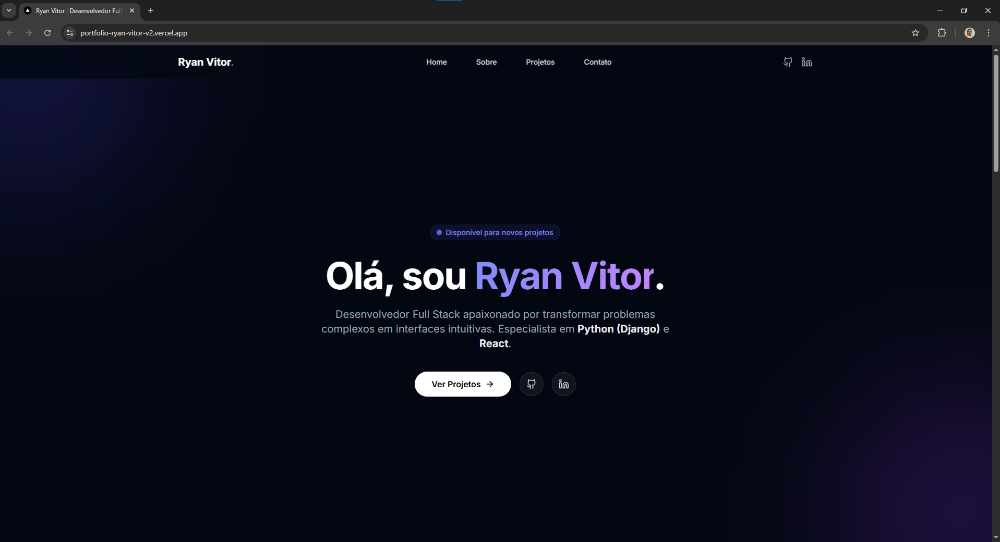

# 🚀 Ryan Vitor - Portfólio Full Stack



> Portfólio moderno, interativo e performático desenvolvido para apresentar projetos de desenvolvimento Full Stack.

[](https://portfolio-ryan-vitor-coral.vercel.app/)
[](https://opensource.org/licenses/MIT)

## 🌐 Demo Online

👉 **Acesse agora:** [portfolio-ryan-vitor-coral.vercel.app](https://portfolio-ryan-vitor-coral.vercel.app/)

---

## 🛠️ Tecnologias Utilizadas

Este projeto foi construído utilizando as melhores práticas do desenvolvimento web moderno:

- **Core:** [Next.js 14](https://nextjs.org/) (App Router), [React](https://react.dev/), [TypeScript](https://www.typescriptlang.org/)
- **Estilização:** [Tailwind CSS](https://tailwindcss.com/)
- **Animações:** [Framer Motion](https://www.framer.com/motion/)
- **Ícones:** [Lucide React](https://lucide.dev/)
- **Email:** Integração com [EmailJS](https://www.emailjs.com/) para formulário de contato.
- **Deploy:** Vercel.

## ✨ Funcionalidades

- **⚡ Performance:** Aplicação SPA (Single Page Application) otimizada para SEO e carregamento rápido.
- **🎨 UI Moderna:** Design System consistente com tema Dark, Glassmorphism (efeito de vidro) e gradientes.
- **📱 Responsividade:** Layout totalmente adaptável para Mobile, Tablet e Desktop.
- **🎥 Previews de Projetos:** Cards interativos com reprodução de vídeo e capas personalizadas.
- **📧 Contato Funcional:** Formulário conectado diretamente ao e-mail via API.

---

## 🚀 Como rodar o projeto localmente

Siga os passos abaixo para testar o projeto na sua máquina:

### 1. Clone o repositório

```bash
git clone [https://github.com/SEU_USUARIO/portfolio-v2.git](https://github.com/SEU_USUARIO/portfolio-v2.git)
cd portfolio-v2
```

### 2. Instale as dependências

```Bash
npm install
# ou
yarn install
```

### 3. Rode o servidor de desenvolvimento

```Bash
npm run dev
```

Acesse http://localhost:3000 no seu navegador para ver o resultado.

📂 Estrutura de Pastas
Uma visão geral da organização do código:

```Bash
portfolio-ryan/
├── public/          # Assets estáticos (imagens, vídeos, favicon)
│   ├── img/         # Fotos de perfil e thumbnails dos projetos
│   └── videos/      # Vídeos de demonstração
├── src/
│   ├── app/         # Páginas e Layout (Next.js App Router)
│   ├── components/  # Componentes Reutilizáveis (Navbar, Hero, Projects, etc.)
│   ├── data/        # Dados estáticos (Lista de projetos e infos do perfil)
│   └── ...
└── ...
```

👨‍💻 Autor
Ryan Vitor

Desenvolvedor Full Stack apaixonado por transformar problemas complexos em interfaces intuitivas.

💼 [LinkedIn - ](https://www.linkedin.com/in/ryan-vitor-09524a246/)

🐙 [GitHub](https://github.com/rcereal)

📱 [WhatsApp](https://api.whatsapp.com/send/?phone=5571983971269&text&type=phone_number&app_absent=0)

Desenvolvido com prazer e muito código.
